# 🛠 Terraform User Guide 🛠

## Description

This repository contains the Terraform configuration to deploy and manage infrastructure in an automated way in the cloud. Terraform is an open source tool from HashiCorp that allows you to define and provision infrastructure as code.

## Prerequisites ✔

Before you start, make sure you have the following installed:
<div style="text-align: left">
    <p>
        <a href="https://www.terraform.io/downloads.html" target="_blank"> </a>
        <a href="https://learn.microsoft.com/es-es/cli/azure/install-azure-cli-windows" target="_blank"> </a>
    </p>
</div>

Before you begin, ensure that you have the following:

- [Terraform](https://www.terraform.io/downloads.html) installed on your local machine.
- AWS CLI installed and configured with your credentials.
- Basic knowledge of Terraform and AWS services.

## Versioning 📚

The project versioning system was carried out with the following tools:

<div style="text-align: left">
    <a href="https://git-scm.com/" target="_blank"> </a>
    <a href="https://github.com/" target="_blank"> </a>
</div>

## Steps 🚀

# Creating an EC2 Instance with Virtual Network (VPC) and VPC using Terraform

This step-by-step guide will walk you through the process of creating an EC2 instance within a Virtual Private Cloud (VPC) and configuring the VPC using Terraform.

### Step 1: Initialize Your Terraform Configuration

1. Create a directory for your Terraform configuration if you haven't already:

   ```bash
   mkdir terraform-ec2-vpc
   cd terraform-ec2-vpc
   ```
Create a Terraform configuration file (e.g., main.tf) in your directory.

Initialize your Terraform configuration:

```bash
terraform init
```
### Step 2: Define Your Virtual Private Cloud (VPC) and Subnet
In your main.tf file, define your VPC and subnet:

```terraform
provider "aws" {
  region = "${var.region}"
}

resource "aws_vpc" "my_vpc" {
  cidr_block = "10.0.0.0/28"
  tags = {
    Name = "${var.vpc_name}"
  }
}

resource "aws_subnet" "my_subnet" {
  vpc_id                  = aws_vpc.my_vpc.id
  cidr_block              = "10.0.0.0/28"
  availability_zone_id    = "${var.subnet_availability_zone}"
  map_public_ip_on_launch = true
  tags = {
    Name = "${var.subnet_name}}"
  }
}
```

### Step 3: Create a Security Group
Define a security group in your main.tf file:
```terraform
resource "aws_security_group" "my_security_group" {
  vpc_id = aws_vpc.my_vpc.id
  name   = "my-security-group"
  ingress {
    from_port   = 22
    to_port     = 22
    protocol    = "tcp"
    cidr_blocks = ["0.0.0.0/0"]
    self        = false
  }

  ingress {
    from_port   = 80
    to_port     = 80
    protocol    = "tcp"
    cidr_blocks = ["0.0.0.0/0"]
    self        = false
  }

  ingress {
    from_port   = 443
    to_port     = 443
    protocol    = "tcp"
    cidr_blocks = ["0.0.0.0/0"]
    self        = false

  }

  ingress {
    from_port   = 8080
    to_port     = 8080
    protocol    = "tcp"
    cidr_blocks = ["0.0.0.0/0"]
    self        = false
  }

  egress {
    from_port        = 0
    to_port          = 0
    protocol         = "-1"
    cidr_blocks      = ["0.0.0.0/0"]
    ipv6_cidr_blocks = ["::/0"]
  }
  tags = {
    Name = "my-security-group"
  }
}
```

### Step 4: Create internet gateway, route table, route-table association, and route
```terraform
resource "aws_internet_gateway" "my_Ig" {
  vpc_id = aws_vpc.my_vpc.id

  tags = {
    Name = "${var.internet_gateway_name}"
  }
}

resource "aws_route_table" "my_route_table" {
  vpc_id = aws_vpc.my_vpc.id

  tags = {
    Name = "${var.route_table_name}"
  }
}

resource "aws_route_table_association" "my_subnet_vpc_route_table_association" {
  subnet_id      = aws_subnet.my_subnet.id
  route_table_id = aws_route_table.my_route_table.id
}

resource "aws_route" "my_route" {
  route_table_id         = aws_route_table.my_route_table.id
  destination_cidr_block = "0.0.0.0/0"
  gateway_id             = aws_internet_gateway.my_Ig.id
}
```

### Step 5: Launch an EC2 Instance
Define an EC2 instance resource in your main.tf file:
```
resource "aws_instance" "my_ec2_instance" {
  ami                         = data.aws_ami.ubuntu.id
  instance_type               = "${var.itype}"
  associate_public_ip_address = true
  key_name                    = "my-ssh-key"
  subnet_id                   = aws_subnet.my_subnet.id
  vpc_security_group_ids      = [aws_security_group.my_security_group.id]
  user_data                   = file("./launch-instance.sh")
  tags = {
    Name    = "${var.ec2_instance_name}"
    project = "${var.ec2_project_name}"
  }
}
```

### Step 6: Apply Your Terraform Configuration
Apply your Terraform configuration to create the resources:

```bash
terraform plan
terraform apply
```
Review the proposed changes and confirm by typing yes.

### Step 7: Access Your EC2 Instance
Once the EC2 instance is created, you can access it using SSH (Linux) or RDP (Windows). Use the key pair you specified in your Terraform configuration.

## Results 🎨🧵

### Of Terraform plan
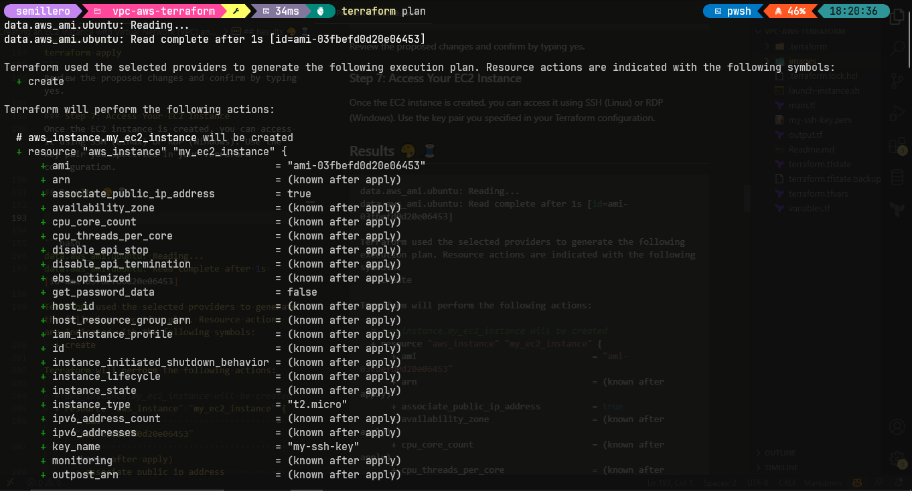
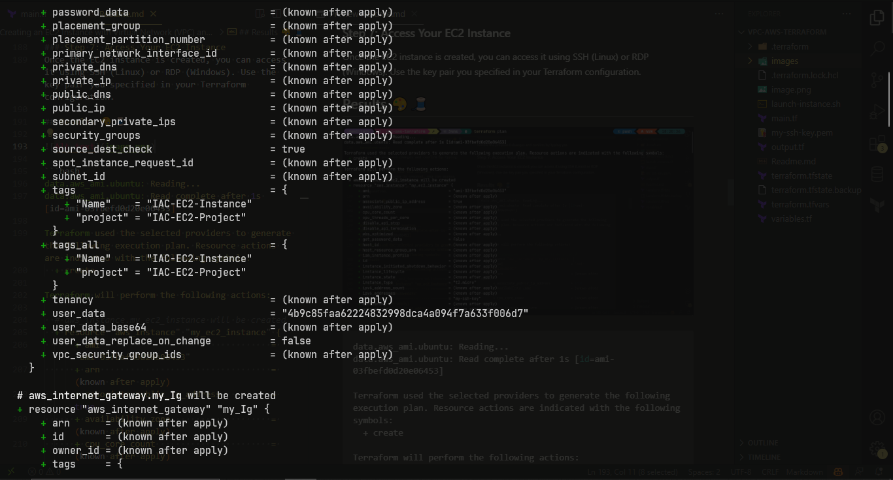
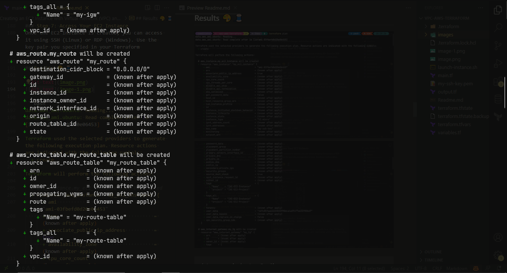
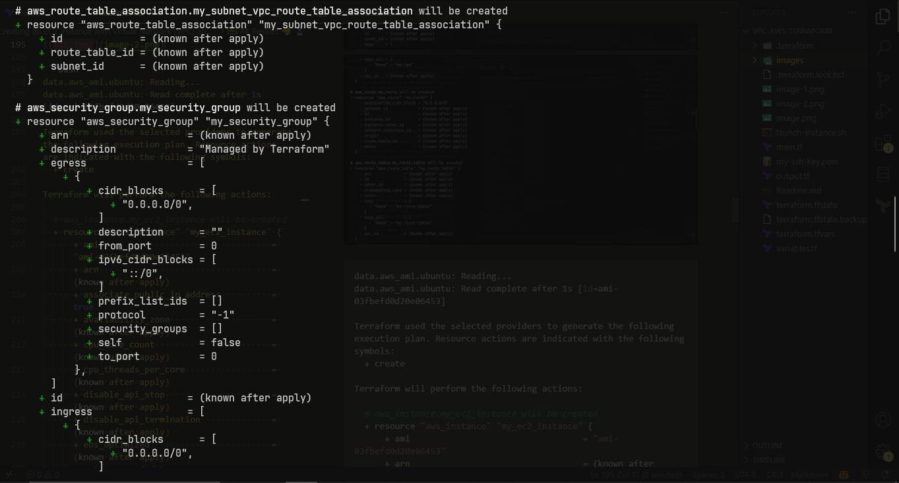
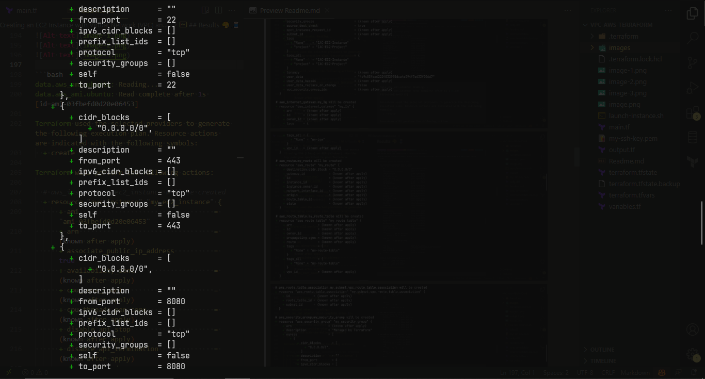
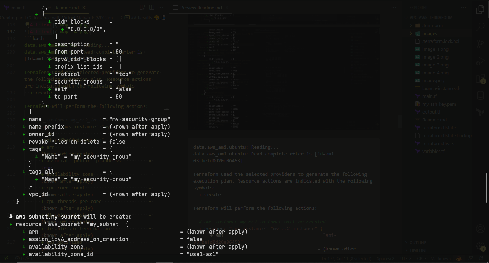
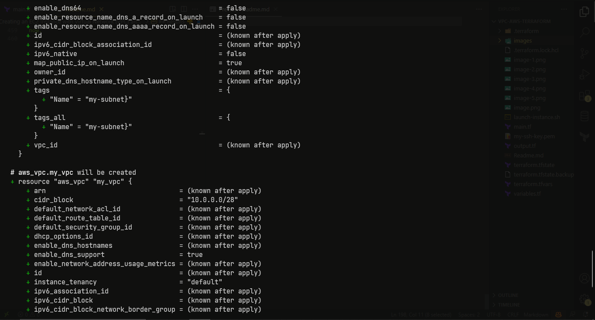
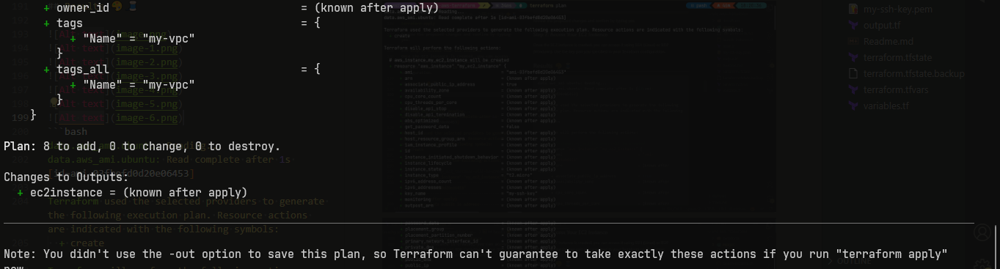


```bash
data.aws_ami.ubuntu: Reading...
data.aws_ami.ubuntu: Read complete after 1s [id=ami-03fbefd0d20e06453]

Terraform used the selected providers to generate the following execution plan. Resource actions are indicated with the following symbols:
  + create

Terraform will perform the following actions:

  # aws_instance.my_ec2_instance will be created
  + resource "aws_instance" "my_ec2_instance" {
      + ami                                  = "ami-03fbefd0d20e06453"
      + arn                                  = (known after apply)
      + associate_public_ip_address          = true
      + availability_zone                    = (known after apply)
      + cpu_core_count                       = (known after apply)
      + cpu_threads_per_core                 = (known after apply)
      + disable_api_stop                     = (known after apply)
      + disable_api_termination              = (known after apply)
      + ebs_optimized                        = (known after apply)
      + get_password_data                    = false
      + host_id                              = (known after apply)
      + host_resource_group_arn              = (known after apply)
      + iam_instance_profile                 = (known after apply)
      + id                                   = (known after apply)
      + instance_initiated_shutdown_behavior = (known after apply)
      + instance_lifecycle                   = (known after apply)
      + instance_state                       = (known after apply)
      + instance_type                        = "t2.micro"
      + ipv6_address_count                   = (known after apply)
      + ipv6_addresses                       = (known after apply)
      + key_name                             = "my-ssh-key"
      + monitoring                           = (known after apply)
      + outpost_arn                          = (known after apply)
      + password_data                        = (known after apply)
      + placement_group                      = (known after apply)
      + placement_partition_number           = (known after apply)
      + primary_network_interface_id         = (known after apply)
      + private_dns                          = (known after apply)
      + private_ip                           = (known after apply)
      + public_dns                           = (known after apply)
      + public_ip                            = (known after apply)
      + secondary_private_ips                = (known after apply)
      + security_groups                      = (known after apply)
      + source_dest_check                    = true
      + spot_instance_request_id             = (known after apply)
      + subnet_id                            = (known after apply)
      + tags                                 = {
          + "Name"    = "IAC-EC2-Instance"
          + "project" = "IAC-EC2-Project"
        }
      + tags_all                             = {
          + "Name"    = "IAC-EC2-Instance"
          + "project" = "IAC-EC2-Project"
        }
      + tenancy                              = (known after apply)
      + user_data                            = "4b9c85faa62224832998dca4a094f7a633f006d7"
      + user_data_base64                     = (known after apply)
      + user_data_replace_on_change          = false
      + vpc_security_group_ids               = (known after apply)
    }

  # aws_internet_gateway.my_Ig will be created
  + resource "aws_internet_gateway" "my_Ig" {
      + arn      = (known after apply)
      + id       = (known after apply)
      + owner_id = (known after apply)
      + tags     = {
          + "Name" = "my-igw"
        }
      + tags_all = {
          + "Name" = "my-igw"
        }
      + vpc_id   = (known after apply)
    }

  # aws_route.my_route will be created
  + resource "aws_route" "my_route" {
      + destination_cidr_block = "0.0.0.0/0"
      + gateway_id             = (known after apply)
      + id                     = (known after apply)
      + instance_id            = (known after apply)
      + instance_owner_id      = (known after apply)
      + network_interface_id   = (known after apply)
      + origin                 = (known after apply)
      + route_table_id         = (known after apply)
      + state                  = (known after apply)
    }

  # aws_route_table.my_route_table will be created
  + resource "aws_route_table" "my_route_table" {
      + arn              = (known after apply)
      + id               = (known after apply)
      + owner_id         = (known after apply)
      + propagating_vgws = (known after apply)
      + route            = (known after apply)
      + tags             = {
          + "Name" = "my-route-table"
        }
      + tags_all         = {
          + "Name" = "my-route-table"
        }
      + vpc_id           = (known after apply)
    }

  # aws_route_table_association.my_subnet_vpc_route_table_association will be created
  + resource "aws_route_table_association" "my_subnet_vpc_route_table_association" {
      + id             = (known after apply)
      + route_table_id = (known after apply)
      + subnet_id      = (known after apply)
    }

  # aws_security_group.my_security_group will be created
  + resource "aws_security_group" "my_security_group" {
      + arn                    = (known after apply)
      + description            = "Managed by Terraform"
      + egress                 = [
          + {
              + cidr_blocks      = [
                  + "0.0.0.0/0",
                ]
              + description      = ""
              + from_port        = 0
              + ipv6_cidr_blocks = [
                  + "::/0",
                ]
              + prefix_list_ids  = []
              + protocol         = "-1"
              + security_groups  = []
              + self             = false
              + to_port          = 0
            },
        ]
      + id                     = (known after apply)
      + ingress                = [
          + {
              + cidr_blocks      = [
                  + "0.0.0.0/0",
                ]
              + description      = ""
              + from_port        = 22
              + ipv6_cidr_blocks = []
              + prefix_list_ids  = []
              + protocol         = "tcp"
              + security_groups  = []
              + self             = false
              + to_port          = 22
            },
          + {
              + cidr_blocks      = [
                  + "0.0.0.0/0",
                ]
              + description      = ""
              + from_port        = 443
              + ipv6_cidr_blocks = []
              + prefix_list_ids  = []
              + protocol         = "tcp"
              + security_groups  = []
              + self             = false
              + to_port          = 443
            },
          + {
              + cidr_blocks      = [
                  + "0.0.0.0/0",
                ]
              + description      = ""
              + from_port        = 8080
              + ipv6_cidr_blocks = []
              + prefix_list_ids  = []
              + protocol         = "tcp"
              + security_groups  = []
              + self             = false
              + to_port          = 8080
            },
          + {
              + cidr_blocks      = [
                  + "0.0.0.0/0",
                ]
              + description      = ""
              + from_port        = 80
              + ipv6_cidr_blocks = []
              + prefix_list_ids  = []
              + protocol         = "tcp"
              + security_groups  = []
              + self             = false
              + to_port          = 80
            },
        ]
      + name                   = "my-security-group"
      + name_prefix            = (known after apply)
      + owner_id               = (known after apply)
      + revoke_rules_on_delete = false
      + tags                   = {
          + "Name" = "my-security-group"
        }
      + tags_all               = {
          + "Name" = "my-security-group"
        }
      + vpc_id                 = (known after apply)
    }

  # aws_subnet.my_subnet will be created
  + resource "aws_subnet" "my_subnet" {
      + arn                                            = (known after apply)
      + assign_ipv6_address_on_creation                = false
      + availability_zone                              = (known after apply)
      + availability_zone_id                           = "use1-az1"
      + cidr_block                                     = "10.0.0.0/28"
      + enable_dns64                                   = false
      + enable_resource_name_dns_a_record_on_launch    = false
      + enable_resource_name_dns_aaaa_record_on_launch = false
      + id                                             = (known after apply)
      + ipv6_cidr_block_association_id                 = (known after apply)
      + ipv6_native                                    = false
      + map_public_ip_on_launch                        = true
      + owner_id                                       = (known after apply)
      + private_dns_hostname_type_on_launch            = (known after apply)
      + tags                                           = {
          + "Name" = "my-subnet}"
        }
      + tags_all                                       = {
          + "Name" = "my-subnet}"
        }
      + vpc_id                                         = (known after apply)
    }

  # aws_vpc.my_vpc will be created
  + resource "aws_vpc" "my_vpc" {
      + arn                                  = (known after apply)
      + cidr_block                           = "10.0.0.0/28"
      + default_network_acl_id               = (known after apply)
      + default_route_table_id               = (known after apply)
      + default_security_group_id            = (known after apply)
      + dhcp_options_id                      = (known after apply)
      + enable_dns_hostnames                 = (known after apply)
      + enable_dns_support                   = true
      + enable_network_address_usage_metrics = (known after apply)
      + id                                   = (known after apply)
      + instance_tenancy                     = "default"
      + ipv6_association_id                  = (known after apply)
      + ipv6_cidr_block                      = (known after apply)
      + ipv6_cidr_block_network_border_group = (known after apply)
      + main_route_table_id                  = (known after apply)
      + owner_id                             = (known after apply)
      + tags                                 = {
          + "Name" = "my-vpc"
        }
      + tags_all                             = {
          + "Name" = "my-vpc"
        }
    }

Plan: 8 to add, 0 to change, 0 to destroy.

Changes to Outputs:
  + ec2instance = (known after apply)

───────────────────────────────────────────────────────────────────────────────────────────────────────────────────────────────────────────────────

Note: You didn't use the -out option to save this plan, so Terraform can't guarantee to take exactly these actions if you run "terraform apply"
now.
```

### Of terraform apply

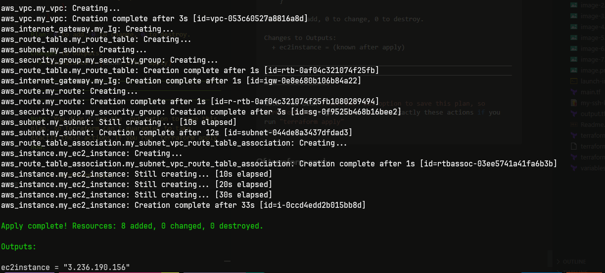

```bash
aws_vpc.my_vpc: Creating...
aws_vpc.my_vpc: Creation complete after 3s [id=vpc-053c60527a8816a8d]
aws_internet_gateway.my_Ig: Creating...
aws_route_table.my_route_table: Creating...
aws_subnet.my_subnet: Creating...
aws_security_group.my_security_group: Creating...
aws_route_table.my_route_table: Creation complete after 1s [id=rtb-0af04c321074f25fb]
aws_internet_gateway.my_Ig: Creation complete after 1s [id=igw-0e8e680b106b84a22]
aws_route.my_route: Creating...
aws_route.my_route: Creation complete after 1s [id=r-rtb-0af04c321074f25fb1080289494]
aws_security_group.my_security_group: Creation complete after 3s [id=sg-0f9525b468b16bee2]
aws_subnet.my_subnet: Still creating... [10s elapsed]
aws_subnet.my_subnet: Creation complete after 12s [id=subnet-044de8a3437dfdad3]
aws_route_table_association.my_subnet_vpc_route_table_association: Creating...
aws_instance.my_ec2_instance: Creating...
aws_route_table_association.my_subnet_vpc_route_table_association: Creation complete after 1s [id=rtbassoc-03ee5741a41fa6b3b]
aws_instance.my_ec2_instance: Still creating... [10s elapsed]
aws_instance.my_ec2_instance: Still creating... [20s elapsed]
aws_instance.my_ec2_instance: Still creating... [30s elapsed]
aws_instance.my_ec2_instance: Creation complete after 33s [id=i-0ccd4edd2b015bb8d]

Apply complete! Resources: 8 added, 0 changed, 0 destroyed.

Outputs:

ec2instance = "3.236.190.156"
```

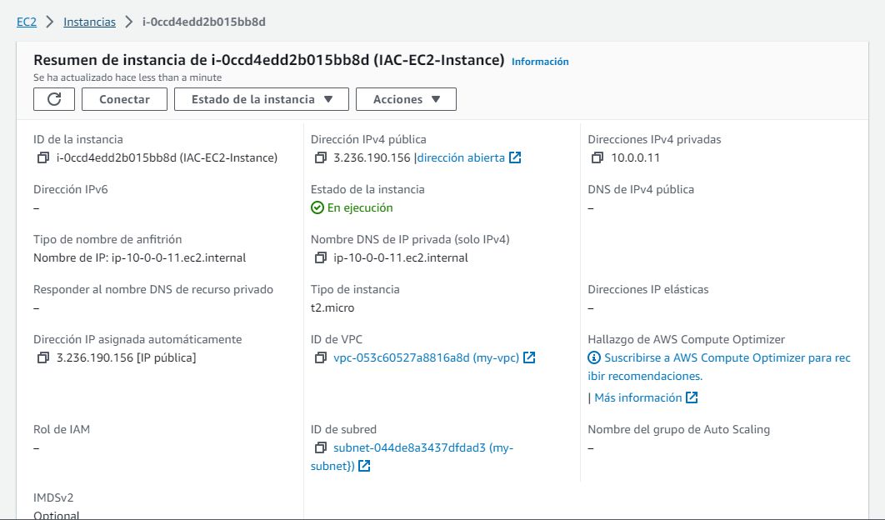
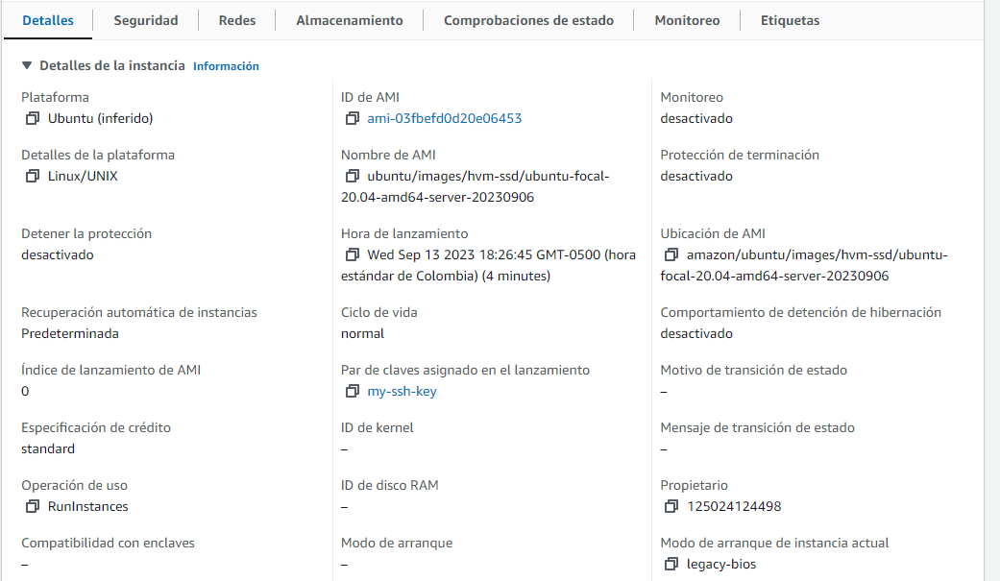
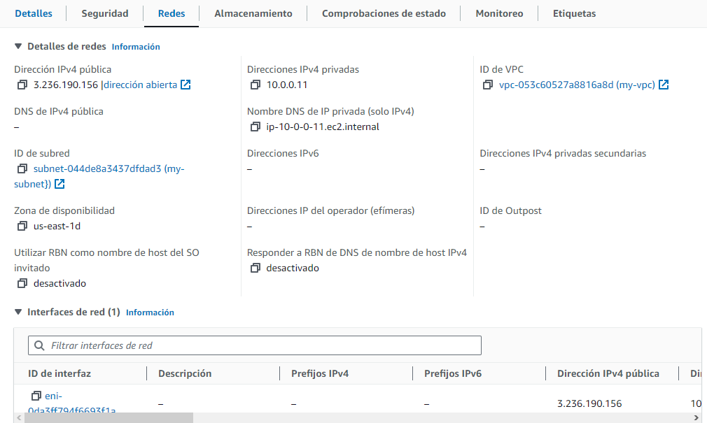